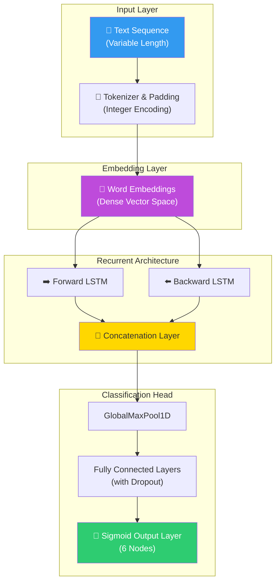
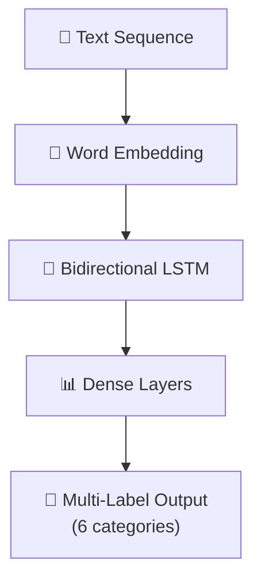

# 🧠 SafeComment: Deep Learning for Content Safety & AI Governance

<p align="center">
  
  
  
  
  
</p>

**SafeComment** è un sistema di classificazione multi-label avanzato basato su Deep Learning, progettato per il monitoraggio e la moderazione automatica di contenuti digitali. Utilizzando architetture **Recurrent Neural Networks (RNN)** con celle **Bidirectional LSTM**, il progetto è in grado di rilevare diverse sfumature di tossicità nel linguaggio naturale, garantendo la sicurezza delle community online e proteggendo la reputazione del brand in ambienti digitali non moderati.

## 🏢 Valore Enterprise & Settori di Applicazione

| Settore / Ambito | Rilevanza & Benefici |
|-------------------|-----------|
| **Social Media & Community** | Moderazione automatica dei commenti generati dagli utenti (UGC) per prevenire bullismo, minacce e discorsi d'odio. |
| **Corporate Communication** | Monitoraggio dei canali di comunicazione interna (es. Slack, Teams) per garantire il rispetto dei codici di condotta aziendali. |
| **AI Safety & Trust** | Filtro preventivo per dataset di addestramento di Large Language Models (LLM) o per il monitoraggio degli output di agenti AI. |
| **Brand Reputation** | Protezione proattiva dei profili social aziendali tramite l'oscuramento immediato di contenuti tossici o offensivi. |

---

## 🎯 Executive Summary & Valore di Business
SafeComment affronta la complessità del linguaggio naturale dove il contesto è fondamentale per distinguere tra una critica legittima e un commento tossico.

### 🏛️ 1. Architettura Neurale Avanzata (Bi-LSTM)
* **Bidirectional Context:** A differenza delle RNN standard, le celle Bidirectional LSTM elaborano il testo in entrambe le direzioni (passato e futuro), permettendo al modello di catturare dipendenze a lungo termine e sfumature semantiche che verrebbero perse con un approccio unidirezionale.
* **Sequence Modeling:** Gestione nativa di sequenze testuali a lunghezza variabile tramite tecniche di padding e troncamento controllato, ottimizzando l'uso dei tensori durante l'addestramento.

### 🤖 2. Multi-Label Classification & Loss Optimization
* **6 Categorie Indipendenti:** Il sistema non si limita a una classificazione binaria (Tossico/Non Tossico), ma assegna probabilità indipendenti a 6 diverse categorie: *toxic, severe_toxic, obscene, threat, insult, identity_hate*.
* **Sigmoid Activation:** Utilizzo di funzioni di attivazione Sigmoid nello strato di output per permettere la sovrapposizione delle classi (un commento può essere simultaneamente tossico e insultante).

### ⚙️ 3. Performance su Larga Scala
* **Big Data Training:** Modello addestrato su un dataset di **160.000 record**, dimostrando la capacità di gestire volumi significativi di dati minimizzando il rischio di overfitting tramite regolarizzazione e Dropout layers.
* **Metriche di Riferimento:** Raggiungimento di un **AUC-ROC di 0.97**, indicando una capacità discriminante eccellente anche su classi fortemente sbilanciate (es. minacce rare vs commenti tossici comuni).

---

## 🏗️ Architettura del Modello



## 🛠️ Stack Tecnologico

| Layer | Tecnologia | Ruolo |
|:------|:-----------|:-----|
| 🐍 **Language** | Python 3.8+ | Core development |
| 🚀 **DL Engine** | TensorFlow 2.x / Keras | Neural Network Framework |
| 🧠 **Layer Type** | Bidirectional LSTM | Sequence Modeling |
| 📊 **Analysis** | pandas / NumPy | Data manipulation |
| 📈 **Metrics** | scikit-learn | Evaluation & Validation |

## 🚀 Setup

```bash
# Clone
git clone https://github.com/sylver86/07-toxic-comments-classifier-rnn-tensorflow.git
cd 07-toxic-comments-classifier-rnn-tensorflow

# Install
pip install -r requirements.txt

# Esplorazione Modello
jupyter notebook notebooks/Progetto_Toxic_Comments_Filter.ipynb
```

<br><br>

*Progettato e sviluppato da Eugenio Pasqua.*

---

# 🇬🇧 ENGLISH VERSION

# 🧠 SafeComment: Deep Learning for Content Safety & AI Governance

<p align="center">
  
  
  
</p>

**SafeComment** is an advanced multi-label classification system based on Deep Learning, designed for automated monitoring and moderation of digital content. Using **Recurrent Neural Networks (RNN)** with **Bidirectional LSTM** cells, the project detects multiple nuances of toxicity in natural language, ensuring online community safety and protecting brand reputation in unmoderated digital environments.

## 🏢 Enterprise Value & Application Sectors

| Sector / Domain | Relevance & Benefits |
|-------------------|-----------|
| **Community Safety** | Automated moderation of user-generated content (UGC) to prevent bullying, threats, and hate speech. |
| **AI Safety & Trust** | Pre-filtering for LLM training datasets or monitoring AI agent outputs. |
| **Brand Reputation** | Proactive protection of corporate social profiles via immediate blocking of toxic content. |

---

## 🏗️ Model Architecture



## 🧰 Technology Stack

`Python 3.8+` · `TensorFlow 2.x` · `Keras` · `Bidirectional LSTM` · `pandas` · `NumPy`

<br><br>

*Designed and developed by Eugenio Pasqua.*
